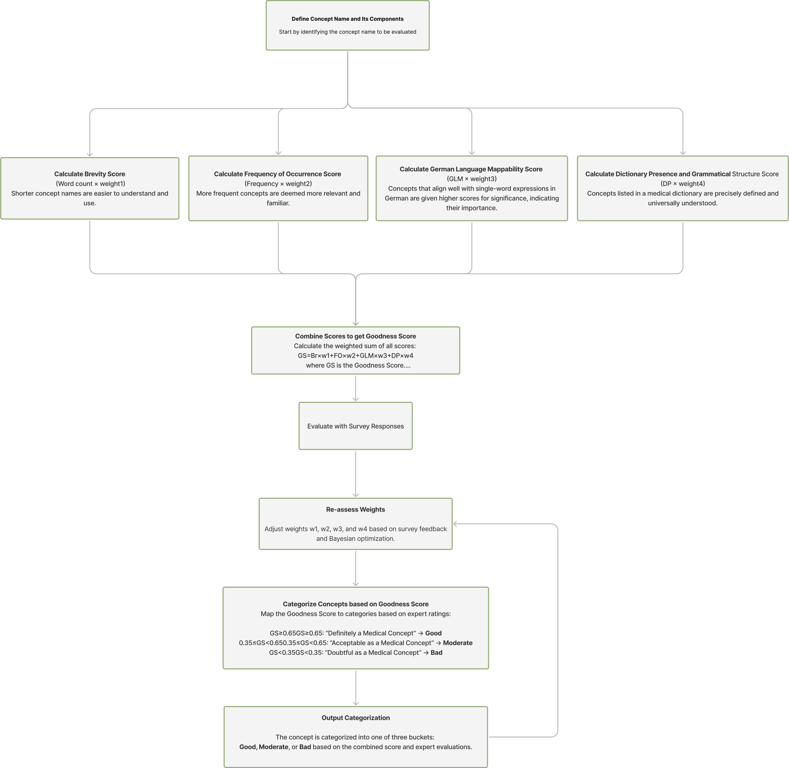

# 📌 Concept Utility
---
Authors: N Khatwani, J Geller  - New Jersey Institute of Technology

Preprint: [What makes a good concept anyway ?](https://arxiv.org/abs/2409.06150)

Contributors: 

---
**A brief description of our project.**  
A medical ontology is expected to cover its domain completely and correctly. On the other hand, large ontologies are hard to build, hard to understand, and hard to maintain. Thus, adding new concepts (often multi-word concepts) to an existing ontology must be done judiciously. Only “useful” concepts should be added; however, it is difficult to define what makes a concept useful. In this research, we propose a metric to measure the utility of a concept. We identified factors that appear to influence “goodness” judgments of medical experts and combined them into a single metric. These factors include concept name length (in words), concept occurrence frequency in the medical literature, and syntactic categories of component words. As an added factor we used the simplicity of a term after mapping it into a specific foreign language.

---

## 🚀 Table of Contents

- [UMLS Concept Retrieval](#about)
- [Semantic Type Filtering](#installation)
- [Word Count of Concepts](#usage)
- [Frequency of Occurence in PUBMED](#features)
- [German Language Mappability](#contributing)
- [Dictionary Presence](#license)
- [Concept Utility Formula](#acknowledgments)
- [Human Physician Survey (Iteration 1)](#)
  - Analysis (Normal Distribution)
  - Bayesian Optimization (Weights Retrieval)
- [Human Physician Survey (Iteration 2)](#)
  - Analysis (Normal Distribution)
  - Bayesian Optimization (Weights Retrieval)
- [Human Physician Survey (Iteration 3)](#)
  - Analysis (Normal Distribution)
  - Bayesian Optimization (Weights Retrieval)
- Limitations
- Future Work

---
## Flow Diagram for the Entire Goodness Formula



---

## 📖 About


---

## 🛠 Installation

(Explain how to install the project.)

```sh
# Example commands
git clone https://github.com/your-username/your-repo.git
cd your-repo
pip install -r requirements.txt  # Modify based on your dependencies
```


